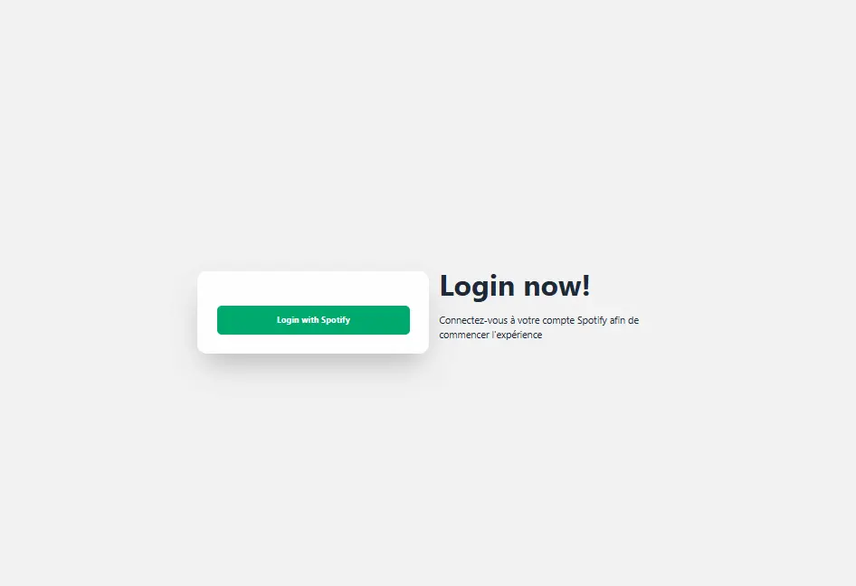
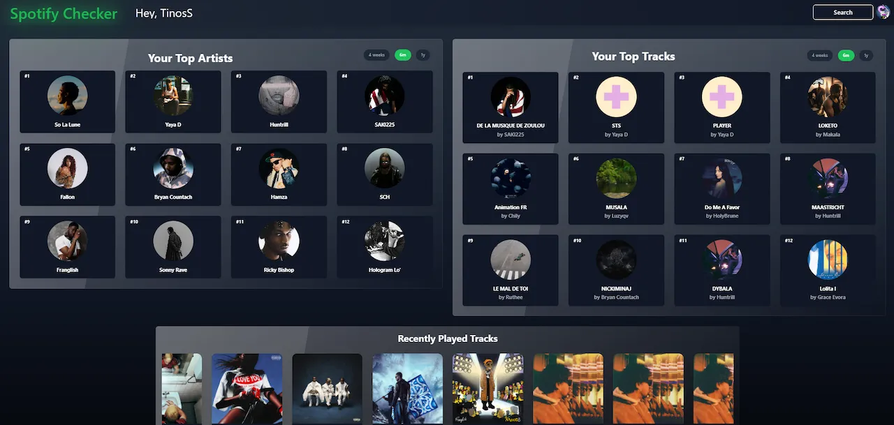
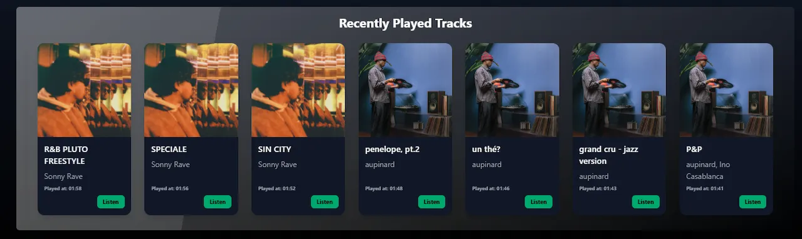

# 🎵 FunnySongChecker

**FunnySongChecker** is a web application that lets users explore their Spotify listening habits:
- favorite artists,
- most played tracks,
- recently played songs,
- and Spotify search results directly from the app.

---

## 🚀 Technologies Used

- Spotify Web API
- React + Vite
- Node.js + Express
- TailwindCSS + DaisyUI
- Deployment with Render

---

## 📸 Project Preview

### 🔐 Spotify Login Page



---

### 🏠 User Dashboard



---

### 🎧 Recently Played Tracks



---

### 🔎 Spotify Search Bar


---

### 🎶 Search Results


---

## 🌐 Usage

1. Contact me at the following email address so I can manually add your Spotify email to the Spotify Developer Dashboard whitelist:

```txt
raphael.salaverria@epitech.eu
```

2. Access the deployed application here:

👉 https://funnysongchecker-1.onrender.com

---

## 🛠️ Local Installation (Optional)

### 1. Clone the repository

```bash
git clone <repository_url>
cd FunnySongChecker
```

---

### 2. Backend Setup

```bash
cd music-search-backend
npm install
node server.js
```

---

### 3. Frontend Setup

```bash
cd react-version/songcheckerreact
npm install
npm run dev
```

---

## 🔑 Spotify Configuration

To run the project locally:

1. Create a Spotify Developer account
2. Create an application on the Spotify Developer Dashboard
3. Retrieve your Spotify credentials
4. Create a `.env` file
5. Add your environment variables

---

## ✨ Features

- Spotify OAuth Authentication
- Favorite artists display
- Most played tracks display
- Recently played songs history
- Spotify integrated search
- Responsive modern UI

---

## 📄 License

This project was created for educational and personal purposes.
